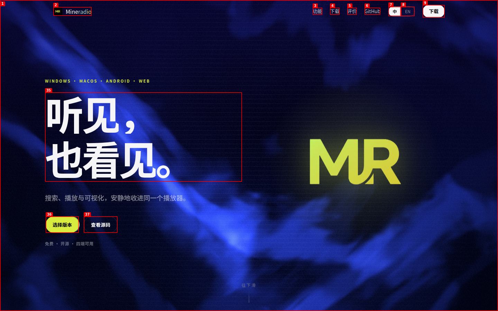
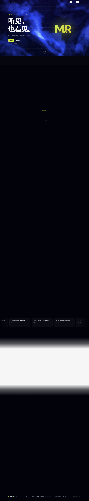

# 网站分析报告：Mineradio 官网

| Field | Value |
|-------|-------|
| **Date** | 2026-08-21 |
| **App URL** | https://mineradio.cn/ |
| **Session** | mineradio |
| **Scope** | 整站信息架构、前端技术栈与性能、功能交互 Bug 发掘（桌面 Chrome + 移动端视口） |

---

## 一、内容结构分析（信息架构 / 页面布局 / 内容组织）

### 1.1 页面标题与基础信息
- `<title>`：**Mineradio 免费开源音乐播放器下载 - Windows/Mac/Android/网页版 - 官网**
- Meta generator：未设置
- 开源协议：Footer 标注 **GPL-3.0**
- GitHub 仓库：https://github.com/XxHuberrr/Mineradio
- 网页版播放器（姊妹站点）：https://mineradio.art

### 1.2 信息架构（单页官网 + 外链）
Mineradio 官网是一个**纯单页（SPA-like 单页锚点）营销官网**，不存在子路由，所有内容靠锚点（`#features` / `#download` / `#praise` / `#support` / `#top`）滚动定位。

```
Header（固定导航栏）
├─ Logo「MR Mineradio」→ 回首页顶部
├─ 功能 → #features
├─ 下载 → #download
├─ 评价 → #praise
├─ GitHub → 新标签页打开 github.com/XxHuberrr/Mineradio
└─ 语言切换：中 / EN

主内容区（纵向区块）
├─ ① Hero 区「听见，也看见。」
│    ├─ 主 H1 + 副标题
│    ├─ CTA 左：选择版本 → 滚动至 #download
│    └─ CTA 右：查看源码 → GitHub
│
├─ ② 特性展示（Features / #features，共 5 个三级标题块）
│    ├─ 「想听什么，一个搜索框」（搜索功能）
│    ├─ 「随节拍生长的视觉」（8 种可视化特效，可点击切换）
│    │   ├─ ≋emily专辑封面 / ∿音域回响 / ✚安魂骷髅 / ✦星河壁纸
│    │   └─ ◎唱片 / ○星球 / ◉滚筒 / ⊘虚空
│    ├─ 「控制条，一眼全局。」（播放控制条）
│    ├─ 「打开，就有安排。」（推荐/播放列表）
│    ├─ 「导入 MP4 壁纸」
│    ├─ 「手势控制」
│    └─ 「360° 自由旋转」（Orbit 功能）
│
├─ ③ 社区评价（Praise / #praise）
│    └─ 6 条用户反馈卡片，含：微博用户 / B站 UP主 / 酷安用户 / 独立博客 / B站用户 / 软件站编辑评测
│
├─ ④ 下载区（Download / #download）
│    ├─ 4 个 Tabs：macOS / Windows / Android / 网页版
│    ├─ 「选择你的入口。」 标题 + 各平台 Get↓ / Open↗ 按钮
│    └─ 「安装前必看」安装说明
│
├─ ⑤ 赞赏/资助区（Support / #support）
│    └─ 「请作者一杯咖啡」 + 赞助二维码/通道展示（静态）
│
Footer
├─ 快速导航：功能 / 下载 / 网页版
├─ 按钮：更新日志（Changelog）
├─ 外链：资助我们 (#support) / GitHub / 抖音
└─ 版权：© Mineradio 版权所有 · GPL-3.0 · 官网 mineradio.cn
```

### 1.3 链接清单
| 位置 | 文字 | 目标 |
|------|------|------|
| Header 导航 | MR Mineradio | 顶部（无hash） |
| Header 导航 | 功能 | `#features` |
| Header 导航 | 下载 | `#download` |
| Header 导航 | 评价 | `#praise` |
| Header 导航 | GitHub | `https://github.com/XxHuberrr/Mineradio`（新标签） |
| Hero CTA | 选择版本 | `#download` |
| Hero CTA | 查看源码 | `https://github.com/XxHuberrr/Mineradio`（新标签） |
| Download Tab macOS | 获取 ↓ | `#`（**无效**，见 ISSUE-001） |
| Download Tab Windows | 获取 ↓ | `https://pan.quark.cn/s/df00d9520835`（新标签，夸克网盘） |
| Download Tab Android | 获取 ↓ | `https://gitee.com/mini-cream-puffs/mineradio-update-package/releases/download/2.1.0/Mineradio_2.1.0.apk`（新标签，APK 直接下载） |
| Download Tab 网页版 | 打开 ↗ | `https://mineradio.art`（新标签） |
| Footer | 功能 | `#features` |
| Footer | 下载 | `#download` |
| Footer | 网页版 | `https://mineradio.art` |
| Footer | 更新日志 | `<button>` 无任何绑定（**无效**，见 ISSUE-002） |
| Footer | 资助我们 | `#support` |
| Footer | GitHub | `https://github.com/XxHuberrr/Mineradio` |
| Footer | 抖音 | `https://v.douyin.com/_TO1zfAfPX0/` |

---

## 二、技术分析（前端技术栈 / 性能 / 加载情况）

### 2.1 前端技术栈

| 维度 | 检测结果 |
|------|----------|
| **框架 / 渲染引擎** | **React 18.3.1（UMD 生产版，由 unpkg.com 加载）** + 自定义 **DC (Delta Component)** 运行时模板引擎（`window.__dcRegistry`, `DCLogic`, `MineradioDS`, `__dcRootName` 等全局） |
| SSR / 框架 | 非 Next.js、非 Nuxt。纯客户端模板渲染。 |
| jQuery / 其它 | 无 jQuery、无 Vue。 |
| 字体 | **Google Fonts Noto Sans SC**（7 个分片 × ~63KB/个，合计约 480KB） |
| 样式表 | 1 个 CSS 请求（全部通过 Google `css2` API 动态加载）。页面 HTML 内含大量 inline style 与内联 `<style id="mr-ds-css">`（MineradioDS 样式）。 |
| 统计 / 分析服务 | ① 百度统计 `hm.baidu.com / _hmt` ② Microsoft Clarity `clarity.js + scripts.clarity.ms + v.clarity.ms + c.clarity.ms / c.bing.com` ③ Cloudflare Web Analytics `static.cloudflareinsights.com / __cfBeacon` |
| CDN | Cloudflare（主站走 CF，响应头带 CF-ray、`cdn-cgi/challenge-platform`） |
| PWA / SW | 未检测到 Service Worker 注册，无 `manifest.json`。 |
| 自定义命名空间 | `window.MineradioDS`、`window.__mrDarkVeil`、`window.__mrCleanup`、`window.__dc*`（8 个以上） |

**重要观察**：主 HTML 单文件即 **913.7 KB**（encodedBodySize），远超普通官网均值（通常 20-100KB）。这说明 React 组件树、DC 模板数据、样式、甚至部分 base64 资源都被**直接内联到了 HTML 文档**里（典型的 DC 模板服务端拼装 / 静态化产物）。

### 2.2 页面性能数据（HAR & Navigation Timing）

| 指标 | 数值 | 评价 |
|------|------|------|
| 总请求数 | **59** | 略高（尤其 Google Fonts 多次分片 + Clarity 3rd-party 8 请求） |
| 主文档体积 | **913.7 KB** / 933,772 bytes | ⚠️ **非常大**，建议拆分 / 启用 Gzip（HAR 中未带压缩信息） |
| 资源传输总和（除主文档） | ≈ 125 KB | 正常 |
| DOM Interactive | **5,445 ms** | ⚠️ 偏慢 |
| DOMContentLoaded | **8,526 ms** | ⚠️ 慢（> 3s 视为差） |
| Load Event End | **8,552 ms** | 同上 |
| Largest 资源（除主文档） | Google Fonts CSS2 **121.3 KB** | 中等 |
| 字体文件数 | **7** 个 Noto Sans SC woff2 | ⚠️ 同一字体 7 次请求（不同 unicode-range），可预连接优化 |
| 图片资源 | 10 张，均不超过 200KB | 正常 |

### 2.3 第三方域名清单（按请求域归类）

```
mineradio.cn              ← 主站 + 资源 (Cloudflare CDN)
unpkg.com                 ← React/ReactDOM UMD 构建
fonts.googleapis.com      ← Google Fonts CSS
fonts.gstatic.com         ← Google Fonts woff2 字体文件
hm.baidu.com              ← 百度统计
www.clarity.ms            ← Microsoft Clarity 脚本
scripts.clarity.ms        ← Clarity 采集 JS
v.clarity.ms / c.clarity.ms ← Clarity 采集 (c.bing.com 同步)
static.cloudflareinsights.com ← Cloudflare 灯塔
c.bing.com                ← Clarity 微软侧同步
```

### 2.4 异常 & 被阻挡请求（status=0）
这些请求并非 Mineradio 本身 Bug，而是 Headless Chrome 隐私 / 反追踪默认策略拦截：
| 状态 | URL | 说明 |
|------|-----|------|
| 0 | `https://mineradio.cn/cdn-cgi/challenge-platform/scripts/jsd/main.js` | Cloudflare JS SDK（headless 拦截） |
| 0 | `https://c.clarity.ms/c.gif` | Clarity 追踪 GIF |
| 0 | `https://c.bing.com/c.gif?...` | Clarity→Bing 追踪 GIF |

---

## 三、Bug 与问题清单（Dogfood 发现）

### Summary

| Severity | Count |
|----------|-------|
| Critical | 0 |
| **High** | **1** |
| **Medium** | **4** |
| **Low** | **1** |
| **Total** | **6** |

---

### ISSUE-001：macOS 版「获取 ↓」下载按钮为死链（href="#"），用户无法下载

| Field | Value |
|-------|-------|
| **Severity** | **high** |
| **Category** | functional |
| **URL** | https://mineradio.cn/#download |
| **Repro Video** | N/A（静态可见问题 + 一次点击即可验证） |

**Description**

下载区切换到 macOS Tab 后，"获取 ↓" 按钮的 `href="#"` 为无效占位值，`target="_blank"` 会使点击后仅打开一个 `about:blank` 新标签页。**核心转化路径被阻断**：Mac 用户无法从官网获取安装包。

对比同级：
- Windows → 夸克网盘（正常）
- Android → Gitee APK 直接下载（正常）
- 网页版 → `mineradio.art`（正常）
- 唯独 **macOS = 空链**。

**Repro Steps**

1. 打开首页，切换到中文模式（确保 Tab 名为 macOS），点击导航"下载"滚动至下载区。
   

2. 点击「macOS」Tab 激活苹果平台下载信息。激活后截图：
   
   （[e43] 为 macOS "Get ↓"，DOM 检查结果：`href="#" target="_blank"`）

3. **Observe**：按钮 DOM 为 `<a href="#" target="_blank">Get ↓</a>`，**用户点击后仅打开空白页**，无任何下载或跳转。

---

### ISSUE-002：Footer「更新日志 / Changelog」按钮无任何事件绑定，点击无反应

| Field | Value |
|-------|-------|
| **Severity** | **medium** |
| **Category** | functional |
| **URL** | https://mineradio.cn/ (Footer 区域) |
| **Repro Video** | videos/issue-changelog-repro.webm |

**Description**

Footer 中「更新日志」（或 EN 模式下 "Changelog"）按钮：
- 为 **`<button class="scp4">`** 标签，
- 无 `onclick` 属性、无 `data-*` 行为指令（仅有 `data-dcTpl="281"` / `data-i18n="foot_clog"` 模板与翻译标记），
- 未注册任何可见的事件监听器。

结果：**用户无论点击多少次，页面状态完全不改变**（无弹窗、无跳转、无内容展开）。该按钮属于视觉上存在，但功能缺失的"幽灵按钮"。

**Repro Steps**

1. 打开首页并滚动到底部（或直接切换语言至中文）。
   

2. 用鼠标点击 Footer「更新日志」按钮。

3. **Observe**：
   - URL 保持 `https://mineradio.cn/` 不变（未触发锚点跳转或内部滚动）。
   - 无任何 Modal / 弹窗 / 抽屉 / 路由变化。
   - 控制台无新的 error 或新的 event dispatch 日志。
   - 截图（点击后 vs 点击前视觉完全一致）：
   

---

### ISSUE-003：英文模式下社区评价区全部中文文本未翻译（i18n 覆盖不完整）

| Field | Value |
|-------|-------|
| **Severity** | **medium** |
| **Category** | content |
| **URL** | https://mineradio.cn/ (Reviews / #praise 区域) |
| **Repro Video** | N/A（静态可见） |

**Description**

点击 Header「EN」切换英文后，导航栏、Hero、Features 标题、Download Tab 名、Footer 等主体翻译生效，但**社区评价区（User Feedback / #praise）共 29 处中文文本完全未翻译**，保持中文原文展示：

用户可见的英文模式残留中文样例：
- 「小作坊下料就是猛，这播放器好评。」—— 微博用户
- 「个人认为当前最夯的音乐播放器。」—— B站 UP 主
- 「耳机党狂喜！」—— B站 UP 主
- 「这个交互体验，目前同类软件几乎没有。」—— 软件站编辑评测
- 「重新定义了桌面音乐播放的体验。」—— 独立博客评测
- 「感谢大佬开源，改出自己的播放器，太雅了。」—— B站用户
- 「装上就没卸载过，天天挂着听。」—— 酷安用户

每一条引文的署名来源（「微博用户」「B站 UP 主」「酷安用户」等）同样为中文。英文用户访问官网时，该区块对他们无可读性。

**Repro Steps**

1. 访问首页 → 点击 Header 右上角「EN」按钮切换语言。
   （对应截图 01-homepage-annotated.png 中的 [8] @e8 "EN"）

2. 滚动至 Reviews（评价）区域。

3. **Observe**：在已切换到英文的页面里，评价引文和来源标签仍全部为中文，与周围的英文 UI（User feedback heading、Choose your door 等）形成明显语言不一致。

---

### ISSUE-004：中文锚点（如 `#功能`、`#下载`）刷新后无法定位，URL hash 被丢弃

| Field | Value |
|-------|-------|
| **Severity** | **medium** |
| **Category** | ux |
| **URL** | https://mineradio.cn/#%E5%8A%9F%E8%83%BD (浏览器实际编码) |
| **Repro Video** | N/A |

**Description**

官网 Header 导航中文字对应**英文锚点**（功能 → `#features`、下载 → `#download`、评价 → `#praise`、资助我们 → `#support`），一切正常。

但当用户手动在地址栏输入**中文锚点**（例如 `https://mineradio.cn/#功能`）——这是常见的分享 / 收藏 / 复制粘贴行为——或由翻译自动工具生成的中文 hash URL 打开时：
- 浏览器会自动将中文编码为 `#%E5%8A%9F%E8%83%BD`，
- 网站初始化时**没有做中文 key → 英文 id 的映射解析**，
- 因此滚动定位失败，页面显示在顶部，hash 随后还会被路由逻辑清理为根 URL。

**Expected**：支持英文锚点的同时，也应兼容中文锚点（至少不丢失 hash，可做 fallback 到对应 id 或顶部）。

**Repro Steps**

1. 在浏览器地址栏输入 `https://mineradio.cn/#功能` 回车。

2. **Observe**：
   - URL 被编码为 `#%E5%8A%9F%E8%83%BD`，但**页面未滚动到功能区**（顶部可见 Hero，不是 Features）。
   - 进一步观察：URL 最终被重写回 `https://mineradio.cn/`，**整个 hash 被丢弃**，用户丢失预期导航目标。

3. 对比组：输入 `https://mineradio.cn/#features` → 正常滚动到功能区，预期行为成立。

---

### ISSUE-005：首屏加载慢（DOMContentLoaded 8.5s，主文档 913.7KB，Google Fonts 重复 7 分片）

| Field | Value |
|-------|-------|
| **Severity** | **medium** |
| **Category** | performance |
| **URL** | https://mineradio.cn/（任意首访） |
| **Repro Video** | N/A |

**Description**

结合 Navigation Timing 与 HAR 数据，当前首屏加载表现显著低于行业平均：

| 指标 | 当前值 | 行业参考阈值 |
|------|--------|-------------|
| DOM Interactive | 5,445 ms | ≤ 1,500 ms 良好 |
| DOMContentLoaded | 8,526 ms | ≤ 3,000 ms 良好 |
| HTML 文档大小 | 913.7 KB | ≤ 100 KB 良好 |
| Google Fonts HTTP 请求数 | 7（7× woff2 + 1 CSS） | 可预连接 / 内联关键字体 / 子集化优化 |

**可能原因**（从资源形态推测）：
1. DC 模板渲染将**所有区块的 HTML 结构、内联样式、部分图片 base64、字体预加载**等都塞进了同一个 HTML，导致单文件膨胀接近 1MB。
2. React 18 UMD 从 unpkg.com 加载（额外 2 个跨站请求 + DNS 解析开销）。
3. 百度统计 + Clarity + Cloudflare Insights 合计**8-10 个第三方脚本/请求**阻塞或延后了 load 事件。
4. Noto Sans SC 7 分片虽由 unicode-range 决定，但在未做 `<link rel="preconnect" href="https://fonts.gstatic.com">` 的情况下分片下载会串行排队。

**Repro Steps**

1. 清空浏览器缓存后首次访问 `https://mineradio.cn/` 并录制 HAR（`page-load.har` 见仓库）。
2. 对比 Navigation Timing 三项关键指标（DOMInteractive / DCL / Load）均超过 5 秒。
3. 检查 HAR 中 `https://mineradio.cn/` 文档本身 `encodedBodySize = 933,772`（≈913.7 KB）即可确认主文档膨胀。

---

### ISSUE-006：控制台每次加载均输出 `[dc-runtime] Root: {{ x }} never resolved — rendered as empty` warning

| Field | Value |
|-------|-------|
| **Severity** | **low** |
| **Category** | console |
| **URL** | https://mineradio.cn/（任意页面状态） |
| **Repro Video** | N/A |

**Description**

页面加载、语言切换、Tab 切换、滚动触发组件重渲染的过程中，控制台都会重复出现一条 warning：

```
[warning] [dc-runtime] Root: {{ x }} never resolved — rendered as empty
```

这条 warning 来自 DC (Delta Component) 运行时，表示某个模板的"Root 级"占位变量 `{{ x }}` 从未被数据层解析，最终被渲染为空。虽然用户在视觉上看不到明显的内容漏洞，但它意味着：
- 部分模板树可能被静默丢弃（该 Root 下的子节点可能根本没渲染出来）；
- 未来在 DC Runtime 升级时，这种未解析变量可能直接演变为更严重的空白或渲染崩溃；
- 日志里 `{{ x }}` 是一个非常通用的占位名，表明它可能来源于模板里写死的调试占位，而非真实业务数据。

**Repro Steps**

1. 打开 `https://mineradio.cn/`，打开浏览器开发者工具 Console。

2. **Observe**：无需任何用户操作，页面加载结束即出现上述 warning。
   （可参考前文 dogfood console 输出日志）

3. 额外触发：点击 EN / 中 切换语言，或点击下载 Tabs，warning 会继续追加输出。

---

## 四、响应式 & 可访问性（受自动化工具能力限制，补充结论）

以下项目在 Headless Chrome 自动化中**已尽可能量化评估**，但键盘 Tab 键遍历、右键菜单拦截、真实移动端 Safari/Chrome 真机测试等，建议由人工 QA 或专用工具补充。

| 项目 | 工具验证结果 | 补充建议 |
|------|-------------|----------|
| **移动端视口（375×812）水平溢出** | ✅ 无溢出（scrollWidth = 375） | 真机 Safari 验证 iOS WebView |
| **移动端标题溢出** | ✅ 无标题宽度超过容器 | 长文标题（如评价引文）真机换行检查 |
| **移动端大图片溢出** | ✅ 所有图片 ≤ 375px | |
| **导航栏折叠 / 汉堡菜单** | ⚠️ 在 375px 截图中仍能看到「功能 下载 评价 GitHub」文字链接（没有汉堡菜单） | 建议人工复查：Header 导航在窄屏是否换行堆叠 / 被遮挡；或专门实现移动端 Drawer |
| **键盘焦点（Tab 顺序）** | ❓ 未验证（自动化工具限制） | 建议人工按 Tab 10+ 次遍历 |
| **图片 alt 属性** | ✅ 主要功能截图和 Logo 均有描述性 alt | |
| **右键菜单禁用** | ❓ 未验证 | 建议人工触发确认 |
| **色盲 / 对比度** | ❓ 未验证 | 重点检查 "获取 ↓" 绿色按钮与深色背景的对比 |

---

## 五、综合评价与修复优先级建议

按业务影响排序（高 → 低）：

1. **P0：ISSUE-001 macOS 下载死链** —— 直接阻断 Mac 用户转化。**成本最低的修复**：补充正确的 macOS 下载地址（如 GitHub Release dmg / 夸克 / 百度网盘 macOS 对应 share link）。
2. **P1：ISSUE-002 更新日志按钮无反应** —— 用户预期获取版本信息却碰壁，损害信任感。修复：要么改为链接到 GitHub Releases / CHANGELOG.md，要么补 Modal 弹出版本历史。
3. **P1：ISSUE-005 首屏 8.5s 性能差** —— 影响所有新用户的第一印象和 SEO（LCP 会因主文档过大而恶化）。修复：拆分 HTML、压缩 + Brotli、preconnect 字体、评估是否继续使用 UMD React 而非打包 Vite/Rollup 产物。
4. **P2：ISSUE-003 英文评价区不翻译** —— 影响海外用户感知。修复：给评价区加 `i18n` 数据源；若不打算翻译，可在 EN 模式下将评价区直接隐藏或改为英文评论。
5. **P2：ISSUE-004 中文锚点不兼容** —— 用户通过分享 URL 回来时定位失败。修复：在路由初始化阶段增加中文 key → 英文 id 的映射表。
6. **P3：ISSUE-006 `{{ x }}` 未解析 warning** —— 不直接伤害用户，但可能是隐藏 Bug 的信号。修复：在 DC 模板源文件中 grep `{{ x }}` 找到对应的 Root，然后补充 data / 删除无效 Root。

---

## 附：产出物索引

| 文件 | 说明 |
|------|------|
| `report.md`（本文件） | 完整分析报告 |
| `page-load.har` | 首次加载 HAR（59 条请求，性能分析原始数据） |
| `screenshots/01-homepage-annotated.png` | 桌面端首页带元素标注截图 |
| `screenshots/02-homepage-full.png` | 桌面端整页长截图 |
| `screenshots/03-macos-tab-state.png` | macOS Tab 激活 + 死链状态标注截图 |
| `screenshots/04-changelog-after-click.png` | 更新日志点击后状态截图 |
| `screenshots/05-mobile-375-full.png` | 移动端 375×812 整页截图 |
| `screenshots/06-mobile-top.png` | 移动端首屏截图 |
| `screenshots/07-mobile-annotated.png` | 移动端带元素标注截图 |
| `videos/issue-changelog-repro.webm` | 更新日志按钮点击无反应复现视频 |
